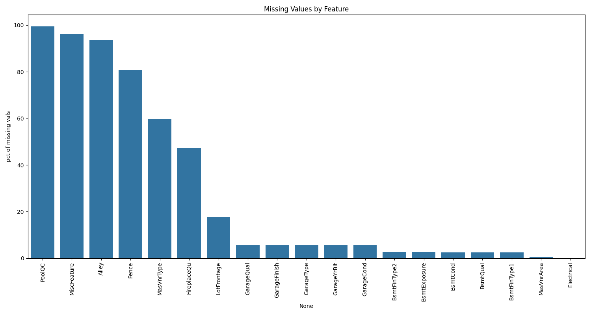

# Ames Housing Dataset: Exploratory Data Analysis


## Project Overview
This repository contains a comprehensive exploratory data analysis (EDA) of the Ames Housing dataset. The analysis examines residential property characteristics in Ames, Iowa, to uncover patterns, relationships, and insights about factors influencing home values.

## Dataset Description
The Ames Housing dataset provides detailed information on residential properties in Ames, Iowa:
- 1,460 observations (properties)
- 81 explanatory variables (features)
- Mix of categorical, ordinal, and numerical data types

### Key Feature Categories:
- **Property Characteristics**: Living area, lot size, neighborhood, zoning, building style
- **Quality Metrics**: Overall quality and condition ratings (scale 1-10)
- **Interior Features**: Bedrooms, bathrooms, kitchen quality, basement details
- **Exterior Characteristics**: Exterior materials, roof style, masonry veneer, porches
- **Garage Information**: Type, size, quality, capacity
- **Land Attributes**: Lot configuration, shape, topography
- **Temporal Data**: Year built, remodeled, and sold

### Target Variable:
- **SalePrice**: The property's sale price in dollars

## Exploratory Data Analysis
The EDA notebook examines the dataset through the following analyses:

### 1. Data Understanding

- Dataset structure and composition
- Feature types and distributions
- Summary statistics for numerical variables
- Frequency distributions for categorical variables
  
### 2. Boxplot of top 6 correlated features

- **OverallQual:** Concentrated at higher values (median ~7), few lower outliers.
- **GrLivArea:** Right-skewed, median around 1500 sq ft, several large outliers.
- **GarageCars:** Median 2 cars, concentrated at 1, 2, and 3, few 0 and 4.
- **GarageArea:** Right-skewed, median ~480 sq ft, several large outliers.
- **TotalBsmtSF:** Right-skewed, many with 0 sq ft, median ~850 sq ft for those with basements, large outliers.
- **1stFlrSF:** Right-skewed, median ~1100 sq ft, large outliers.

### 3. Missing Value Analysis

- "PoolQC", "MiscFeature", "Alley", and "Fence" have the highest percentage of missing values (>80%).
- "MasVnrType" and "FireplaceQu" also exhibit a significant number of missing values.
- Features like "LotFrontage" and various garage/basement-related features show a smaller percentage of missing data.
- "Electrical" and "MasVnrArea" have minimal to no missing values.

### 4. Distribution of Saleprice after normalization

- Distribution of the target variable (SalePrice)
- Assessment of normality and skewness
- Distribution of key numerical features
- Detection and analysis of outliers

### 5. Correlation Analysis

- The heatmap displays the correlation coefficients between "SalePrice" and other top features.
- "SalePrice" shows a strong positive correlation with "OverallQual" (0.79) and "GrLivArea" (0.71).
- "GarageCars" (0.64) and "GarageArea" (0.62) also exhibit a strong positive correlation with "SalePrice".
- "TotalBsmtSF" and "1stFlrSF" have a positive correlation of 0.61 with "SalePrice".
- "FullBath" (0.56), "TotRmsAbvGrd" (0.53), "YearBuilt" (0.52), and "YearRemodAdd" (0.51) show moderate positive correlations with "SalePrice".
- There are also strong correlations among the independent variables, such as between "GarageCars" and "GarageArea" (0.88), and between "TotalBsmtSF" and "1stFlrSF" (0.82).

### 6. SalePrice vs top 9 correlated features

**Key observations from the scatter plots:**

- **OverallQual (0.79):** There's a clear positive trend; as the overall quality of the house increases, the sale price tends to increase. The relationship appears somewhat linear but with distinct steps corresponding to the discrete nature of the quality ratings.
- **GrLivArea (0.71):** A strong positive linear relationship is evident. Larger above-ground living area generally corresponds to higher sale prices.
- **GarageCars (0.64):** Sale price tends to increase with the number of cars the garage can accommodate. There are distinct vertical bands due to the discrete number of garage cars.
- **GarageArea (0.62):** Similar to "GarageCars", a positive relationship exists, with larger garage areas generally associated with higher sale prices. There's more scatter compared to "GarageCars", suggesting other factors influence sale price beyond just garage size.
- **TotalBsmtSF (0.61):** A positive trend is visible; larger total basement square footage is generally linked to higher sale prices.
- **1stFlrSF (0.61):** A positive relationship is observed, indicating that larger first-floor square footage tends to correspond to higher sale prices.
- **FullBath (0.56):** Sale price generally increases with the number of full bathrooms, although the relationship is less tight than with living area or garage size. The discrete nature of the number of bathrooms is apparent.
- **TotRmsAbvGrd (0.53):** A positive trend exists, suggesting that a higher number of rooms above ground is generally associated with a higher sale price.
- **YearBuilt (0.52):** There's a general positive trend, indicating that newer houses tend to have higher sale prices. However, there's considerable variation, suggesting other factors play a significant role.

### 7. Key Insights and Findings
- Critical factors driving home values in Ames
- Notable patterns in the housing market
- Potential feature importance for predictive modeling
- Data quality issues and recommendations

## Key EDA Findings
- Identified strongest price predictor variables
- Uncovered neighborhood pricing patterns and anomalies
- Quantified the relationship between house quality metrics and price
- Mapped temporal trends in housing values
- Detected outliers and their impact on the dataset

## Technologies Used
- **Python Libraries**:
  - **Pandas & NumPy**: Data manipulation and analysis
  - **Matplotlib & Seaborn**: Data visualization
  - **SciPy**: Statistical analysis

## Repository Structure
```
├── data/
│   └── ames_housing.csv
├── notebooks/
│   └── ames_housing_eda.ipynb 
├── images/                
│   ├── correlation_heatmap.png
│   ├── price_distribution.png
│   └── ...
├── README.md         
└── requirements.txt     
```

## Getting Started

### Prerequisites
- Python 3.8+
- Required packages: pandas, numpy, matplotlib, seaborn

### Installation
1. Clone this repository
```bash
https://github.com/Shivadzn/eda-house-price-prediction.git
```

2. Install dependencies
```bash
pip install -r requirements.txt
```

3. Run the Jupyter notebook
```bash
jupyter notebook notebooks/ames_housing_eda.ipynb
```

## Insights for Future Modeling
The EDA reveals several key considerations for subsequent predictive modeling:
- Logarithmic transformation recommended for the target variable
- Feature engineering opportunities identified for several variables
- Potential feature selection strategy based on correlation analysis
- Data preprocessing steps needed before modeling

## Contact
- **Name**: [Shiva]
- **Email**: [shivajaiswaldzn@gmail.com]
- **GitHub**: [Your GitHub Profile](https://github.com/yourusername)
